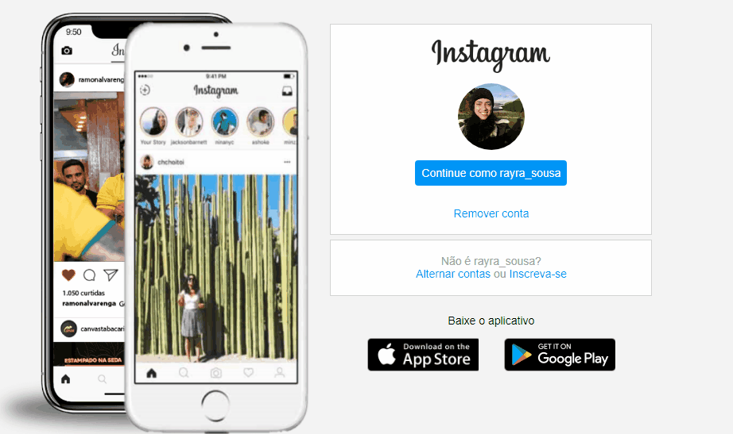

# Reconstituição da página login do instagram

Projeto desenvolvido na aula do curso Digital Innovation One, com alguns detalhes a mais! 

  

### Linguagens utilizadas:

🗸 HTML5  
🗸CSS

## Autor(a)

| Rayra de Sousa  
| rayratanisiadigital@gmail.com 
| [Meu Linkedin](https://www.linkedin.com/in/rayra-tanisia-sousa-624578204/)

Um pouco das linguagens de tecnologia que estou aprendendo.❤️🚧
